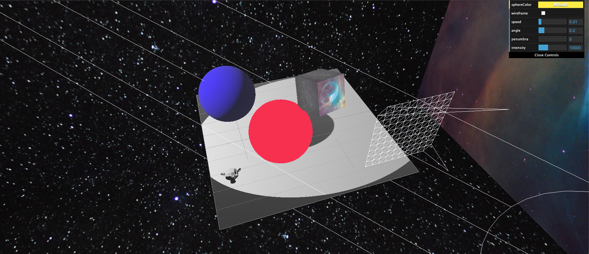

Coding along `https://www.youtube.com/watch?v=xJAfLdUgdc4&list=PLjcjAqAnHd1EIxV4FSZIiJZvsdrBc1Xho`

# Installation and setup
Install missing packages
```sh
npm i parcel -g
npm i three
npm i dat.gui
```
Let `parcel` create a bundle and run test webpage: `parcel ./src/index.html`

# Screenshot
